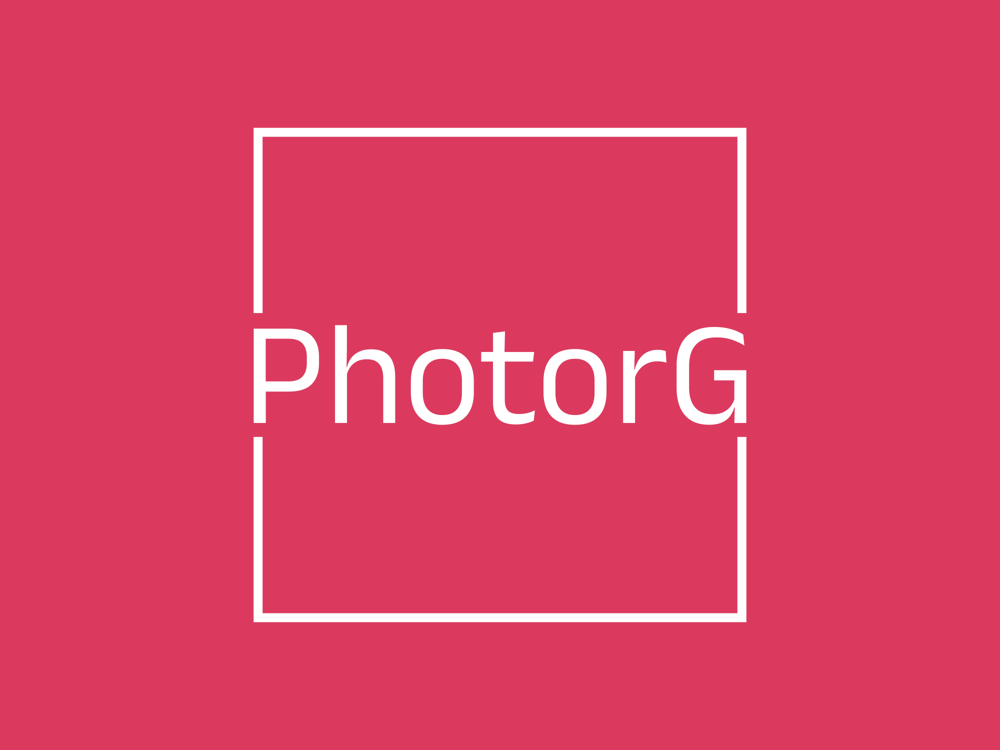
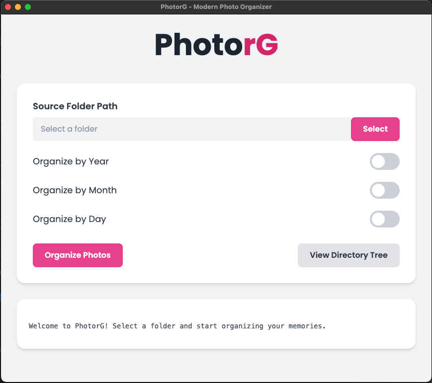

# PhotorG: Organize Your Photos by Date

PhotorG is a photo organization tool available as both a C++ command-line program and an Electron-based GUI application. It helps you organize your photos by the date they were created, using multi-threading for efficient processing.




## Features

- Automatically detects the creation date of each photo
- Organizes photos into directories based on the date they were taken
- Supports various image file formats (JPEG, PNG, TIFF, HEIC, etc.)
- Utilizes multi-threading to speed up the processing of large photo collections
- Available as both CLI and GUI applications

This will result in a directory structure like this:

```
./Photos
├── 2023
│ ├── 2023-01
│ │ ├── 2023-01-01
│ │ ├── 2023-01-02
│ │ └── 2023-01-03
│ └── 2023-02
│ ├── 2023-02-01
│ ├── 2023-02-02
│ └── 2023-02-03
└── 2024
├── 2024-01
│ ├── 2024-01-01
│ ├── 2024-01-02
│ └── 2024-01-03
└── 2024-02
├── 2024-02-01
├── 2024-02-02
└── 2024-02-03
```

## CLI Version

### Prerequisites

- C++17 compatible compiler (e.g., GCC 8.0 or later)
- `pthread` library installed on your system

### Building and Running the CLI Version

1. Clone the repository:

```bash
git clone https://github.com/yiwoduf/PhotorG.git
```

2. Change to the project directory:

```bash
cd PhotorG
```

3. Compile the program:

```bash
   g++ -std=c++17 -o photorg photorg.cpp -lpthread
```

4. Run the program:

```
./photorg
```

`Settings.ini` file contains the following configuration:

```
PATH = ./Photos
YEARLY = true
MONTHLY = true
DAILY = true
```

When you run the `./photorg` command, the program will:

1. Scan the `./Photos` directory for all photo files.
2. Organize the photos into directories based on the year, month, and day they were taken.
3. Save the organized photos in the same `./Photos` directory.

For more details on using the CLI version, refer to the original README content below.

## GUI Version (Electron)

### Prerequisites

- Node.js (v18 or later recommended)
- npm (usually comes with Node.js)

### Building and Running the GUI Version

1. Clone the repository (if you haven't already):

```bash
git clone https://github.com/yiwoduf/PhotorG.git
```

2. Change to the Electron project directory:

```bash
cd PhotorG/photorg-electron
```

3. Install dependencies:

```bash
npm install
```

4. Run the application in development mode:

```bash
npm run start
```

### Building for Distribution

To build the Electron app for distribution:

1. For all platforms:

```bash
   npm run build
```

2. For specific platforms:

- macOS: `npm run build:mac`
- Windows: `npm run build:win`
- Linux: `npm run build:linux`

The built applications will be available in the `dist` directory.

## Contributing

If you find any issues or have suggestions for improvements, please feel free to open an issue or submit a pull request on the [GitHub repository](https://github.com/yiwoduf/PhotorG).

## License

This project is licensed under the [MIT License](LICENSE).
